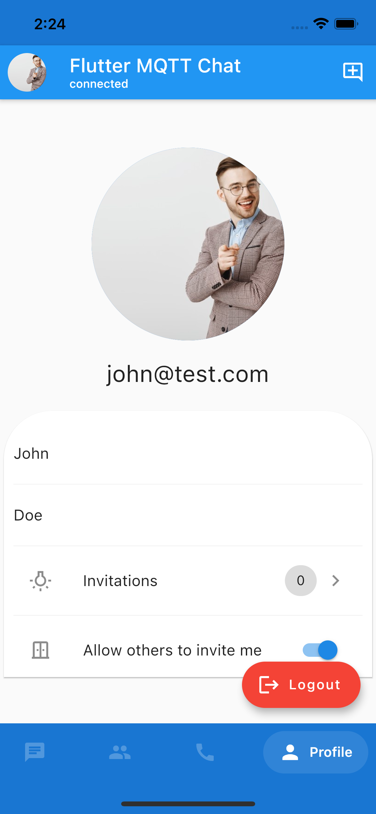
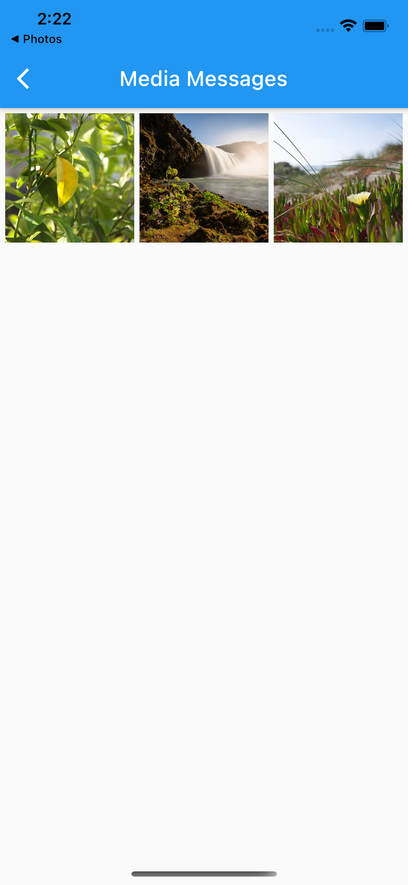

# Flutter Chat app using MQTT.
The Broker should install [HiveMQ Chat-Extension](https://github.com/WahidNasri/hivemq-chat-extension) first.

## Use Flutter-MQTT-Chat-Client as a library
To use this library inside your project with your custom UI, please refer to [The Wiki](wiki.md)
## Screenshots
| Login      | Rooms      | Chat
|:------------:|:-------------:|:-------:
|  |  |
|Profile | Contact details | Media messages
|  |  |

## P0 Features
- [x] Login
- [x] Send & receive messages
- [x] Typing indicator
- [x] Send Files
- [x] Persist User, Messages and rooms using local database
- [x] ChatMarker (In Progress)
- [x] Invite a user to chat
- [x] Group Chat
- [x] Presence (Testing...)
- [x] File Previews (PDF and images Done)
- [ ] In App Notifications
- [ ] Push Notifications When App is in Background.

## P1 Features
- [ ] Poll Messages
- [ ] Pinned Messages
- [ ] Self-Destructive Messages
- [ ] Request Attention
  
## P2 Features
- [ ] Recognize adult content on image message
- [ ] Blurred content messages

